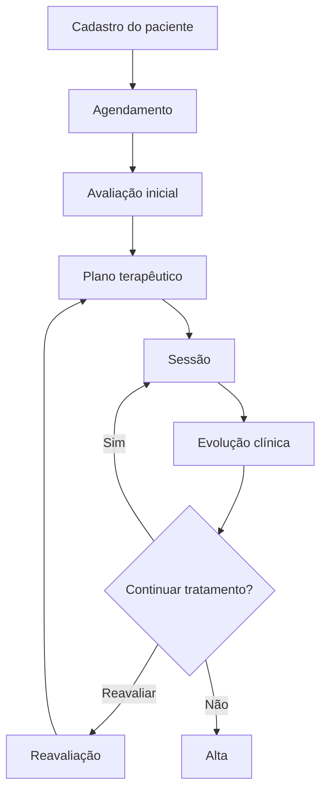

# TechLab+  Fisio OrtoSport

> Sistema web para gestão de clínicas de fisioterapia, centralizando pacientes, agenda, avaliações, planos terapêuticos, sessões, evolução clínica e financeiro em uma única plataforma.

## Sobre o projeto

O **TechLab+  Fisio OrtoSport** é uma plataforma desenvolvida para simplificar e organizar a rotina de clínicas e profissionais de fisioterapia.

O sistema busca reduzir processos manuais e informações descentralizadas, oferecendo uma visão integrada de toda a jornada do paciente:

```text
Paciente
   ↓
Agendamento
   ↓
Avaliação inicial
   ↓
Plano terapêutico
   ↓
Sessões
   ↓
Evolução clínica
   ↓
Alta / Continuidade
```

Além do acompanhamento clínico, a plataforma poderá centralizar atividades administrativas, financeiras e operacionais da clínica.

---

## Objetivos

O TechLab+  Fisio OrtoSport tem como principais objetivos:

- centralizar as informações dos pacientes;
- facilitar o gerenciamento da agenda;
- registrar avaliações fisioterapêuticas;
- estruturar planos terapêuticos;
- acompanhar sessões e evolução clínica;
- manter histórico completo dos atendimentos;
- melhorar a organização da clínica;
- reduzir tarefas administrativas manuais;
- facilitar o acompanhamento financeiro;
- oferecer informações para apoio à gestão.

---

## Funcionalidades

### Pacientes

- Cadastro de pacientes;
- Informações pessoais e de contato;
- Histórico clínico;
- Anamnese;
- Condições e observações relevantes;
- Histórico de atendimentos;
- Documentos e anexos;
- Busca e filtros.

---

### Agenda

- Agendamento de consultas e sessões;
- Visualização diária, semanal e mensal;
- Reagendamento;
- Cancelamento;
- Controle de presença;
- Identificação de faltas;
- Bloqueio de horários;
- Agenda por profissional.

---

### Avaliação fisioterapêutica

Registro estruturado da avaliação inicial do paciente, permitindo armazenar informações como:

- queixa principal;
- histórico da condição;
- avaliação funcional;
- amplitude de movimento;
- força muscular;
- dor;
- limitações;
- testes específicos;
- observações clínicas;
- diagnóstico fisioterapêutico;
- objetivos terapêuticos.

---

### Plano terapêutico

Permite definir e acompanhar o planejamento do tratamento:

- objetivos;
- condutas;
- exercícios;
- técnicas utilizadas;
- frequência das sessões;
- quantidade prevista de sessões;
- reavaliações;
- evolução dos objetivos.

---

### Sessões

Cada atendimento poderá possuir seu próprio registro contendo:

- data e horário;
- profissional responsável;
- procedimentos realizados;
- exercícios;
- técnicas aplicadas;
- observações;
- resposta do paciente;
- evolução clínica;
- intercorrências;
- próximos passos.

---

### Evolução clínica

O sistema permitirá acompanhar a evolução do paciente ao longo do tratamento.

```text
Avaliação inicial
       ↓
   Sessão 01
       ↓
   Sessão 02
       ↓
   Sessão 03
       ↓
   Reavaliação
       ↓
Continuidade / Alta
```

O histórico deverá permitir visualizar facilmente a progressão do tratamento.

---

### Profissionais

- Cadastro de profissionais;
- Especialidades;
- Dados profissionais;
- Registro profissional;
- Agenda individual;
- Pacientes vinculados;
- Histórico de atendimentos.

---

### Financeiro

Planejado para contemplar:

- cobrança de consultas e sessões;
- pacotes de atendimento;
- pagamentos;
- formas de pagamento;
- contas a receber;
- descontos;
- inadimplência;
- fluxo financeiro;
- relatórios.

---

### Relatórios

O sistema poderá disponibilizar indicadores como:

- quantidade de atendimentos;
- pacientes ativos;
- novos pacientes;
- taxa de faltas;
- sessões realizadas;
- tratamentos concluídos;
- faturamento;
- produtividade por profissional;
- evolução dos pacientes.

---

## Perfis de acesso

O TechLab+  Fisio OrtoSport deverá possuir controle de acesso baseado em perfis.

### Administrador

Acesso completo ao sistema.

Responsável por:

- usuários;
- configurações;
- profissionais;
- financeiro;
- relatórios;
- permissões.

### Recepção

Responsável principalmente por:

- pacientes;
- agenda;
- agendamentos;
- pagamentos;
- atividades administrativas.

### Fisioterapeuta

Responsável principalmente por:

- avaliações;
- prontuário;
- sessões;
- planos terapêuticos;
- evolução clínica;
- acompanhamento dos pacientes.

---

## Segurança

Por trabalhar com informações pessoais e clínicas, segurança deve ser tratada como requisito fundamental.

O projeto deverá considerar:

- autenticação segura;
- autorização baseada em perfis;
- controle de acesso aos prontuários;
- proteção de dados sensíveis;
- criptografia de comunicação;
- auditoria de alterações;
- logs de acesso;
- backups;
- proteção contra acessos indevidos;
- boas práticas relacionadas à LGPD.

---

## Auditoria

Operações importantes deverão possuir rastreabilidade.

Exemplo:

```text
Ação: alteração de evolução clínica

Paciente: João da Silva
Usuário: Dr. Fulano
Data: 18/09/2026 14:32

Campo:
Observação clínica

Valor anterior:
...

Novo valor:
...
```

Nenhuma informação clínica relevante deverá ser alterada sem possibilidade de rastreamento.

---

## Stack sugerida

### Frontend

```text
Next.js
React
TypeScript
Tailwind CSS
```

### Backend

```text
NestJS
Node.js
TypeScript
REST API
OpenAPI
```

### Banco de dados

```text
PostgreSQL
```

### Gerenciamento de dependências

```text
pnpm
```

### Testes

```text
Jest
Playwright
```

### Infraestrutura

```text
Docker
Docker Compose
GitHub Actions
```

---

## Arquitetura inicial

A aplicação poderá utilizar uma arquitetura de **monólito modular**, permitindo simplicidade operacional sem comprometer a organização do domínio.

```text
┌─────────────────────────────┐
│          Frontend           │
│        Next.js / React      │
└──────────────┬──────────────┘
               │
               │ HTTPS / REST
               ▼
┌─────────────────────────────┐
│            API              │
│           NestJS            │
│                             │
│ ┌─────────────────────────┐ │
│ │ Auth                    │ │
│ │ Pacientes               │ │
│ │ Agenda                  │ │
│ │ Profissionais           │ │
│ │ Avaliações              │ │
│ │ Prontuário              │ │
│ │ Sessões                 │ │
│ │ Financeiro              │ │
│ │ Relatórios              │ │
│ └─────────────────────────┘ │
└──────────────┬──────────────┘
               │
               ▼
┌─────────────────────────────┐
│         PostgreSQL          │
└─────────────────────────────┘
```

---

## Estrutura sugerida do projeto

```text
TechLab+  Fisio OrtoSport/
│
├── apps/
│   ├── web/
│   │   └── Next.js
│   │
│   └── api/
│       └── NestJS
│
├── packages/
│   ├── contracts/
│   ├── ui/
│   ├── config/
│   └── test-utils/
│
├── docs/
│
├── infra/
│   ├── docker/
│   └── scripts/
│
├── .github/
│   └── workflows/
│
├── docker-compose.yml
├── pnpm-workspace.yaml
└── README.md
```

---

## Domínios principais

Uma possível divisão inicial dos módulos:

```text
Auth
│
├── Usuários
├── Perfis
└── Permissões

Pacientes
│
├── Cadastro
├── Histórico
├── Documentos
└── Dados clínicos

Agenda
│
├── Agendamentos
├── Disponibilidade
├── Cancelamentos
└── Presença

Clínico
│
├── Avaliações
├── Planos terapêuticos
├── Sessões
├── Evoluções
└── Alta

Profissionais
│
├── Cadastro
├── Especialidades
└── Agenda

Financeiro
│
├── Cobranças
├── Pagamentos
├── Pacotes
└── Relatórios

Auditoria
│
├── Eventos
├── Histórico
└── Logs
```

---

## Fluxo principal



---

## Princípios do projeto

### Simplicidade

Evitar complexidade arquitetural sem necessidade real.

### Modularidade

Cada domínio deve possuir responsabilidades claras.

### Segurança

Dados pessoais e clínicos devem ser protegidos desde o início.

### Rastreabilidade

Alterações relevantes devem possuir histórico.

### Testabilidade

Regras de negócio importantes devem possuir testes automatizados.

### Escalabilidade gradual

Começar simples e adicionar infraestrutura somente quando houver necessidade comprovada.

---

## Qualidade

Toda funcionalidade relevante deve considerar:

```text
Implementação
     ↓
Testes unitários
     ↓
Testes de integração
     ↓
Lint / TypeScript
     ↓
Build
     ↓
Testes E2E
```

Casos de teste devem contemplar, quando aplicável:

- fluxo principal;
- dados vazios;
- dados inválidos;
- limites;
- permissões;
- concorrência;
- alto volume.

---

## Roadmap inicial

### Fase 1 — Fundação

- [ ] Estrutura inicial do projeto;
- [ ] Banco de dados;
- [ ] Autenticação;
- [ ] Usuários;
- [ ] Perfis e permissões;
- [ ] Auditoria básica.

### Fase 2 — Pacientes

- [ ] Cadastro;
- [ ] Consulta;
- [ ] Edição;
- [ ] Histórico;
- [ ] Anamnese.

### Fase 3 — Agenda

- [ ] Agenda dos profissionais;
- [ ] Agendamento;
- [ ] Reagendamento;
- [ ] Cancelamento;
- [ ] Controle de presença.

### Fase 4 — Prontuário

- [ ] Avaliação inicial;
- [ ] Plano terapêutico;
- [ ] Registro de sessões;
- [ ] Evoluções;
- [ ] Reavaliação;
- [ ] Alta.

### Fase 5 — Financeiro

- [ ] Cobranças;
- [ ] Pagamentos;
- [ ] Pacotes;
- [ ] Controle financeiro;
- [ ] Relatórios.

### Fase 6 — Evoluções futuras

- [ ] Notificações;
- [ ] Integração com WhatsApp;
- [ ] Assinatura digital;
- [ ] Portal do paciente;
- [ ] Aplicativo mobile;
- [ ] Teleatendimento;
- [ ] Dashboards avançados;
- [ ] Inteligência artificial para apoio operacional e documental.

---

## Status

```text
🚧 Em desenvolvimento
```

O projeto encontra-se em fase inicial de definição e implementação.

Os requisitos e a arquitetura poderão evoluir conforme necessidades reais da operação forem identificadas.

---

## Licença

A licença do projeto deverá ser definida antes da distribuição ou disponibilização pública do código.

---

# TechLab+  Fisio OrtoSport

**Gestão clínica organizada. Atendimento com continuidade. Evolução acompanhada.**
