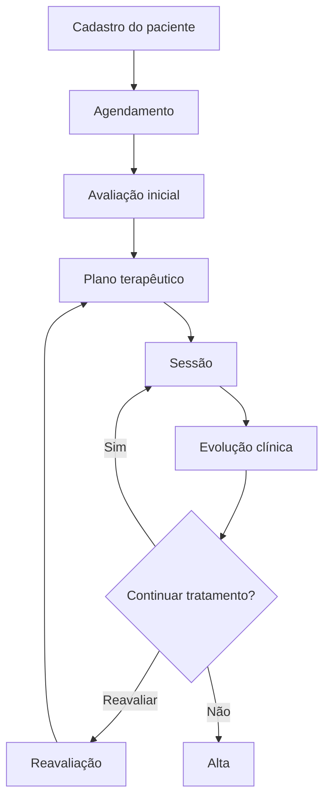

# TechLab+  Fisio OrtoSport

> Sistema web para gestão de clínicas de fisioterapia, centralizando pacientes, agenda, avaliações, planos terapêuticos, sessões, evolução clínica e financeiro em uma única plataforma.

## Sobre o projeto

O **TechLab+  Fisio OrtoSport** é uma plataforma desenvolvida para simplificar e organizar a rotina de clínicas e profissionais de fisioterapia.

O sistema busca reduzir processos manuais e informações descentralizadas, oferecendo uma visão integrada de toda a jornada do paciente:

```text
Paciente
   ↓
Agendamento
   ↓
Avaliação inicial
   ↓
Plano terapêutico
   ↓
Sessões
   ↓
Evolução clínica
   ↓
Alta / Continuidade
```

Além do acompanhamento clínico, a plataforma poderá centralizar atividades administrativas, financeiras e operacionais da clínica.

---

## Objetivos

O TechLab+  Fisio OrtoSport tem como principais objetivos:

- centralizar as informações dos pacientes;
- facilitar o gerenciamento da agenda;
- registrar avaliações fisioterapêuticas;
- estruturar planos terapêuticos;
- acompanhar sessões e evolução clínica;
- manter histórico completo dos atendimentos;
- melhorar a organização da clínica;
- reduzir tarefas administrativas manuais;
- facilitar o acompanhamento financeiro;

---

## Funcionalidades

### Pacientes

- Cadastro de pacientes;
- Informações pessoais e de contato;
- Histórico clínico;
- Anamnese;
- Condições e observações relevantes;
- Histórico de atendimentos;
- Documentos e anexos;
- Busca e filtros.

---

### Agenda

- Agendamento de consultas e sessões;
- Visualização diária, semanal e mensal;
- Reagendamento;
- Cancelamento;
- Bloqueio de horários;
- Agenda por profissional.

---

### Avaliação fisioterapêutica

Registro estruturado da avaliação inicial do paciente, permitindo armazenar informações como:

- queixa principal;
- histórico da condição;
- avaliação funcional;
- amplitude de movimento;
- força muscular;
- dor;
- limitações;
- testes específicos;
- observações clínicas;
- diagnóstico fisioterapêutico;
- objetivos terapêuticos.

---

### Plano terapêutico

Permite definir e acompanhar o planejamento do tratamento:

- objetivos;
- exercícios;
- técnicas utilizadas;
- quantidade prevista de sessões;
- reavaliações;

---

### Sessões

Cada atendimento poderá possuir seu próprio registro contendo:

- data e horário;
- profissional responsável;
- exercícios;
- técnicas aplicadas;
- observações;
- evolução clínica;
- próximos passos.

---

### Evolução clínica

O sistema permitirá acompanhar a evolução do paciente ao longo do tratamento.

```text
Avaliação inicial
       ↓
   Sessão 01
       ↓
   Sessão 02
       ↓
   Sessão 03
       ↓
   Reavaliação
       ↓
Continuidade / Alta
```

O histórico deverá permitir visualizar facilmente a progressão do tratamento.

---

### Profissionais

- Cadastro de profissionais;
- Especialidades;
- Dados profissionais;
- Agenda individual;
- Pacientes vinculados;
- Histórico de atendimentos.

---

### Financeiro

Planejado para contemplar:

- cobrança de consultas e sessões;
- pagamentos;
- formas de pagamento;
- contas a receber;
- fluxo financeiro;
- relatórios.

---

### Relatórios

O sistema poderá disponibilizar indicadores como:

- quantidade de atendimentos;
- novos pacientes;
- sessões realizadas;
- tratamentos concluídos;
- faturamento;
- produtividade por profissional;

---

## Perfis de acesso

O TechLab+  Fisio OrtoSport deverá possuir controle de acesso baseado em perfis.

### Administrador

Acesso completo ao sistema.

Responsável por:

- usuários;
- configurações;
- profissionais;
- financeiro;
- relatórios;
- permissões.

### Recepção

Responsável principalmente por:

- pacientes;
- agenda;
- agendamentos;
- pagamentos;
- atividades administrativas.

### Fisioterapeuta

Tem também todos os acessos da Recepção (cadastro de pacientes e agenda de qualquer profissional); não gerencia usuários.

Responsável principalmente por:

- avaliações;
- prontuário;
- sessões;
- planos terapêuticos;
- evolução clínica;
- acompanhamento dos pacientes.

---

## Segurança

O projeto deverá considerar:

- autenticação segura;
- autorização baseada em perfis;


---

## Stack sugerida
React
Next.js
Tailwind CSS
shadcn
Prisma

### Banco de dados

```text
PostgreSQL
```

### Gerenciamento de dependências

```text
pnpm
```

### Testes

```text
Jest
```

### Infraestrutura

```text
Docker composer
```

---

## Execução local

Pré-requisitos: Node.js 20.9+ (testado com 24), pnpm 11 e Docker.

```bash
cp .env.example .env      # ajuste as variáveis (inclusive SEED_ADMIN_*)
pnpm install              # também gera o Prisma Client (postinstall)
pnpm db:up                # sobe o PostgreSQL via Docker Compose
pnpm db:migrate           # aplica as migrações do Prisma
pnpm db:seed              # cria o primeiro Administrador (idempotente)
pnpm db:admin --email <e-mail>  # cria o Administrador ou redefine a senha dele (pede a senha no terminal)
pnpm dev                  # http://localhost:3000 → /login
```

Variáveis do `.env` (modelo em `.env.example`):

| Variável | Uso |
|---|---|
| `POSTGRES_*`, `DATABASE_URL` | Banco local via Docker Compose |
| `DATABASE_URL_UNPOOLED` | Opcional no desenvolvimento. Conexão direta usada pelo Prisma; se ausente, migrações usam `DATABASE_URL`. Nos ambientes remotos, as duas URLs são obrigatórias e próprias de cada ambiente. |
| `SEED_ADMIN_NAME`, `SEED_ADMIN_EMAIL`, `SEED_ADMIN_PASSWORD` | Primeiro Administrador criado por `pnpm db:seed`. Senha com no mínimo 8 caracteres. Se o e-mail já existir, o seed não altera nada. |
| `SETUP_TOKEN` | Opcional. Habilita o primeiro acesso pela tela de login enquanto não há usuários (mínimo de 32 caracteres). Sem ela, o cadastro pela web fica desligado. Remova depois do primeiro cadastro; ver [`src/modules/auth/README.md`](src/modules/auth/README.md#primeiro-acesso-tabela-de-usuários-vazia). |
| `TRUST_PROXY` | Opcional. `true` só atrás de um proxy próprio que sobrescreva `x-forwarded-for`; na Vercel não é necessária. Sem proxy confiável, o limite de tentativas por IP não é aplicado; ver [`src/modules/auth/README.md`](src/modules/auth/README.md#limites-de-tentativas). |
| `DEMO_DATA_TARGET` | Opcional, só em desenvolvimento. Alvo `host/banco` (local) em que o Administrador pode popular dados fictícios em Configurações → Desenvolvimento. Ausente = desligado. Nunca defina em produção; ver [`src/modules/dados-ficticios/README.md`](src/modules/dados-ficticios/README.md). |
| `DEV_RESET_TARGET` | Opcional, só em desenvolvimento e **destrutiva**. Alvo `host/banco` (local) em que o Administrador pode limpar a base pela aba Configurações → Desenvolvimento, preservando usuários, configurações e auditoria. Independente de `DEMO_DATA_TARGET`. Ausente = desligado. Nunca defina em produção; ver [`src/modules/manutencao/README.md`](src/modules/manutencao/README.md). |

A autenticação não usa segredo de assinatura (`AUTH_SECRET`). A sessão é um token aleatório num cookie `httpOnly`, e o banco guarda só o hash dele. Detalhes em [`src/modules/auth/README.md`](src/modules/auth/README.md).

O fluxo de publicação é `main → PR manual para production → Neon/Vercel Preview → workflow manual para Neon/Vercel Production`. Push em `main` executa somente CI. Alvos, variáveis, homologação e recuperação estão em [`docs/project/pipeline-deploy.md`](docs/project/pipeline-deploy.md).

| Script | Função |
|---|---|
| `pnpm dev` / `pnpm build` / `pnpm start` | Desenvolvimento, build e servidor de produção |
| `pnpm lint` | ESLint |
| `pnpm typecheck` | Gera tipos de rotas do Next.js e roda `tsc --noEmit` |
| `pnpm test` | Jest + Testing Library |
| `pnpm test:pipeline` | Verifica isolamento dos bancos, histórico de migrações e vínculo do candidato Preview com a release |
| `pnpm db:up` / `pnpm db:down` | Sobe/derruba o PostgreSQL local |
| `pnpm db:migrate` / `pnpm db:generate` / `pnpm db:studio` | Migrações, geração do client e Prisma Studio |
| `pnpm db:seed` | Cria o primeiro Administrador a partir do `.env` |
| `pnpm db:admin --email <e-mail> [--name "<nome>"]` | Cria o Administrador, se o e-mail não existir, ou redefine a senha dele (reativa e encerra as sessões). Recusa e-mail de outro perfil (não promove ninguém). Mostra só host e banco; pede confirmação (`sim` no banco local, o **nome do banco** no remoto) e a senha sem eco, nunca por argumento. Para o Neon, defina `DATABASE_URL` com a URL direta só nesse terminal |
| `pnpm db:reset [--executar] [--incluir-auditoria]` | **Destrutivo.** Reinicializa os dados preservando todos os usuários e as configurações (issue #62). Sem `--executar` é só simulação; com ele, pede o nome do banco e `LIMPAR`, e roda numa transação com conferências. A auditoria só é apagada com `--incluir-auditoria` (exceção A5/A7). Execução em ambiente real exige alvo e autorização registrados; procedimento em `src/modules/manutencao/README.md` |
| `pnpm db:normalizar-nomes [--executar]` | Adequa os nomes cadastrais já gravados (usuários, pacientes, responsáveis e identificação da clínica) ao contrato em maiúsculas (issue #78). Sem `--executar` é só simulação com contagens; com ele, pede o nome do banco e roda numa transação. Idempotente; não altera snapshots clínicos nem auditoria. Em ambiente real, registre alvo e autorização antes; ver `src/modules/manutencao/README.md` |

---

## Domínios principais

Uma possível divisão inicial dos módulos:

```text
Auth
│
├── Usuários
├── Perfis
└── Permissões

Pacientes
│
├── Cadastro
├── Histórico
├── Documentos
└── Dados clínicos

Agenda
│
├── Agendamentos
├── Disponibilidade
├── Cancelamentos
└── Presença

Clínico
│
├── Avaliações
├── Planos terapêuticos
├── Sessões
├── Evoluções

Profissionais
│
├── Cadastro
├── Especialidades
└── Agenda

Financeiro
│
├── Cobranças
├── Pagamentos
├── Pacotes
└── Relatórios

Auditoria
│
├── Eventos
├── Histórico
└── Logs
```

---

## Fluxo principal


```mermaid
flowchart TD
    A[Cadastro do paciente] --> B[Agendamento]
    B --> C[Avaliação inicial]
    C --> D[Plano terapêutico]
    D --> E[Sessão]
    E --> F[Evolução clínica]
    F --> G{Continuar tratamento?}
    G -->|Sim| E
    G -->|Reavaliar| H[Reavaliação]
    H --> D
    G -->|Não| I[Alta]
```

---

## Princípios do projeto

### Simplicidade

Evitar complexidade arquitetural sem necessidade real.

### Modularidade

Cada domínio deve possuir responsabilidades claras.


### Escalabilidade gradual

Começar simples e adicionar infraestrutura somente quando houver necessidade comprovada.

---

## Qualidade

Toda funcionalidade relevante deve considerar:

```text
Implementação
     ↓
Testes unitários
     ↓
Lint / TypeScript
     ↓
Build
```

Casos de teste devem contemplar, quando aplicável:

- fluxo principal;

---

## Roadmap inicial

### Fase 1 — Fundação

- [x] Estrutura inicial do projeto;
- [x] Banco de dados;
- [x] Autenticação;
- [x] Usuários;
- [x] Perfis e permissões;

### Fase 2 — Pacientes

- [x] Cadastro;
- [x] Consulta;
- [x] Edição;
- [x] Histórico clínico de sessões; vínculo com a agenda ainda pendente;
- [x] Anamnese subjetiva versionada;
- [x] Cadastro complementar da ficha (sexo, profissão e CREFITO do fisioterapeuta).
- [x] Documentos de impressão (termo, cartão de frequência e ficha de anamnese), gerados sem armazenamento.

### Fase 3 — Agenda

- [x] Agenda dos profissionais por período;
- [x] Agendamento;
- [x] Reagendamento;
- [x] Cancelamento;
- [x] Visões dia, semana e lista;
- [ ] Bloqueio de horários, horário de funcionamento, presença e visão mensal;

### Fase 4 — Prontuário

- [x] Avaliação inicial com histórico de alterações;
- [x] Plano terapêutico com revisões imutáveis;
- [x] Registro de sessões, correção e invalidação;
- [x] Evoluções por atendimento;
- [x] Reavaliação comparativa com retorno ao plano;
- [ ] Alta operacional — indicação de alta documentada não encerra o tratamento automaticamente.

### Fase 5 — Financeiro

- [x] Cobranças manuais com cancelamento, substituição e histórico (FIN-01, #86);
- [ ] Pagamentos;
- [ ] Controle financeiro;
- [ ] Relatórios.

### Fase 6 — Evoluções futuras

- [ ] Notificações;
- [ ] Integração com WhatsApp;
- [ ] Assinatura digital;
- [ ] Portal do paciente;
- [ ] Aplicativo mobile;
- [ ] Teleatendimento;
- [ ] Dashboards avançados;
- [ ] Inteligência artificial para apoio operacional e documental.

---

## Status

```text
🚧 Em desenvolvimento — fundação e núcleo clínico implementados e testados; pacientes e agenda com pendências de integração e escopo. Revisão: 26/09/2026.
```

O roadmap detalhado, separado por status e responsabilidade, está em [`docs/project/roadmap.md`](docs/project/roadmap.md). O briefing modular está em [`docs/PROJECT.md`](docs/PROJECT.md).

O roadmap inclui correções e melhorias priorizadas, critérios de aceite e evidências. Implementação e CI não comprovam funcionamento em produção; publicação e interface autenticada não foram verificadas nesta revisão.

Os requisitos e a arquitetura poderão evoluir conforme necessidades reais da operação forem identificadas.

---

## Licença

A licença do projeto deverá ser definida antes da distribuição ou disponibilização pública do código.

---

# TechLab+  Fisio OrtoSport

**Gestão clínica organizada. Atendimento com continuidade. Evolução acompanhada.**
