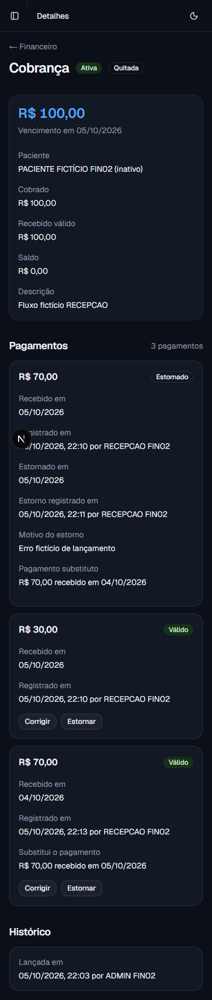

# Issue #87 — FIN-02: pagamentos parciais e estornos

## Baseline e contrato

Implementação autorizada por Bruno em 05/10/2026, após o levantamento e aprovação do plano.
Checkout isolada na branch `codex/fin-02-pagamentos-estornos`, baseada na `main`
`5b48c78f0eba8f46ac518f10b3f28fd949a67fec` ([FIN-01, PR #92](https://github.com/BrunoMNoronha/fisio-orto-sport/pull/92)).
As alterações locais da checkout original foram preservadas. O gate de início foi conferido
no [briefing](../16-financeiro-integracoes.md), na [VAL-03](val-03-revalidacao-perfis.md)
e na [PR #91](https://github.com/BrunoMNoronha/fisio-orto-sport/pull/91), com os limites históricos preservados.

- `Payment` registra valor exato em centavos, data civil, autoria da sessão, instante técnico,
  chave e fingerprint; `PaymentReversal` preserva o original, motivo, data e autoria.
  UPDATE/DELETE são recusados no banco; FKs restritivas e unicidades protegem vínculos.
- Recebimento aceita data retroativa, inclusive anterior à cobrança; data futura é recusada.
  Estorno exige motivo e data entre o recebimento original e hoje em `America/Sao_Paulo`.
  Datas técnicas entre 2000 e 2100; o instante de registro permanece separado.
- Correção de pagamento válido grava estorno e substituto na mesma transação/cobrança.
  A data do substituto pode preceder a do estorno. Original já estornado permite substituto
  explícito sem mudar o estorno anterior; recebimento comum não cria vínculo automaticamente.
- Saldo = cobrado menos soma dos pagamentos sem estorno. `Charge.status` continua
  `ATIVA`/`CANCELADA`; Aberta/Parcial/Quitada são derivadas. Cancelar/substituir cobrança exige
  ausência de pagamento válido, inclusive no banco.
- Escritas usam `READ COMMITTED`, trava da mesma `Charge` e consultas posteriores à trava.
  Guards rejeitam excedentes, cobrança cancelada e substituição entre cobranças ou sem estorno.
  Não há retry de escrita. Reenvio compatível retorna o primeiro resultado antes das regras de
  saldo/estado, preservando autoria; conteúdo diferente com a mesma chave é recusado.
- Chaves com namespaces `RECEBIMENTO`, `ESTORNO`, `CORRECAO`; SHA-256 `v1` de conteúdo canônico
  inclui operação, alvo, valor, datas, motivo e vínculo aplicáveis.
- Actions autorizam antes de consultar/escrever. ADMIN, RECEPCAO e FISIOTERAPEUTA mantêm
  alcance igual; anônimo/inativo negados. Paciente inativo pode regularizar lançamentos.
  Leituras administrativas não incluem conteúdo clínico. Saldo e histórico compartilham
  snapshot `RepeatableRead`, com 20 pagamentos por página e totais sobre toda a cobrança.
- Inventários de exclusão e reset incluem pagamentos/estornos. O reset manual continua
  transacional; não constitui recuperação. Rollback da aplicação preserva tabelas/histórico.

Detalhes e APIs no [módulo financeiro](../../../src/modules/financeiro/README.md).

## Validação do candidato

Execução local em 05/10/2026 (São Paulo), Node 24.19.0, pnpm 11.25.0, Next.js 16.3.5.
PostgreSQL **18**, contêiner próprio e descartável `fisio-fin02-1791248346`, publicado somente
no loopback. Bancos separados `fin02_test` (integração) e `fin02_browser` (interface).
Somente dados fictícios; nenhum banco de desenvolvimento preexistente, Preview ou Production
foi migrado. Credenciais e arquivos temporários ficaram ignorados e não entram no commit.

| Verificação | Resultado |
|---|---|
| `pnpm install --frozen-lockfile --prefer-offline` | Aprovado; lockfile preservado, dependências próprias na worktree. |
| `pnpm exec prisma validate` / `pnpm db:generate` | Aprovados. |
| `pnpm lint` | Sem erros nem avisos do projeto. |
| `pnpm typecheck` | Aprovado. |
| `pnpm test --runInBand` | 88 suítes, 1.068 testes aprovados. |
| `pnpm test:pipeline` | 9 testes aprovados. |
| Integração completa | 30 suítes, 177 testes aprovados, zero pulados, PostgreSQL 18. |
| `pnpm build` | Aprovado; Next.js 16.3.5/Turbopack, incluindo as novas rotas. Recompilado após ajuste final da mensagem para original já estornado. |
| Migração aditiva | 27 migrações aplicadas no banco descartável; `prisma migrate diff --from-config-datasource --to-schema prisma/schema.prisma --exit-code` sem diferenças; SQL FIN-02 aceito por `assertCompatibleMigrations` da pipeline. |

O comando de integração carregou explicitamente o `.env` exclusivo do banco descartável:
`pnpm exec tsx --env-file=.env --conditions=react-server --test --test-concurrency=1 test/integration/*.integration.ts`.
O pnpm local emite aviso sobre `globalShims` da configuração global (opção de versão posterior),
sem mudança nas dependências ou no projeto. A primeira tentativa de Jest incluiu um separador
`--` desnecessário e não selecionou testes; a execução completa acima usou a sintaxe correta.

### PostgreSQL real

As novas suítes `financeiro-pagamentos.integration.ts` e
`financeiro-pagamentos-migration.integration.ts` verificam:

- R$ 100,00 recebidos em R$ 30,00 + R$ 70,00, centavos, excedentes e datas;
- concorrência por saldo, pagamento × cancelamento e estorno × cancelamento nas duas ordens;
- estorno repetido, substituição de cobrança, cinco reenvios simultâneos de cada operação,
  conteúdo incompatível e reenvio depois de estorno/cancelamento;
- conexões independentes, barreiras controladas e `pg_blocking_pids` para provar espera na trava;
  recusas esperadas exigem a classe/mensagem de negócio, não aceitam timeout/deadlock como sucesso;
- correção e falha sem histórico parcial, substituto explícito da mesma cobrança;
- SQL direto: imutabilidade, CHECKs, FKs, namespaces/fingerprints, saldo, cancelamento,
  vínculos e isolamento inadequado;
- migração sobre schema anterior com linhas preexistentes idênticas antes/depois e TRUNCATE
  compatível com manutenção; novos vínculos de autoria nas suítes de exclusão;
- reset com pagamento, estorno e substituto, preservação dos usuários/auditoria e rollback
  completo após falha, incluindo restauração da proteção de auditoria.

Chamadas diretas das actions são exercitadas nos testes unitários com a matriz real de permissões,
sessão e persistência substituídas por mocks: três perfis, autoria forjada ignorada,
anônimo/inativo negados antes de consultas/escritas. Essa evidência é distinta da sessão real no navegador.

### Navegador autenticado

`next dev` na porta 3187 ligado somente a `fin02_browser`; Chrome com sessão exclusiva.
Três usuários fictícios com senhas aleatórias descartadas; entrada pelo acesso rápido existente
de desenvolvimento. Paciente inativo, quatro cobranças de R$ 100,00 e histórico com 22 pagamentos.

- **RECEPCAO:** recebeu R$ 30,00 → saldo R$ 70,00; R$ 70,01 recusado; R$ 70,00 → quitada.
  Estorno sem motivo mostrou erro; motivo informado estornou R$ 70,00 e reabriu saldo.
  Registrou substituto explícito retroativo em 04/10, anterior ao estorno de 05/10 e à criação
  da cobrança. Quitação restabelecida, com original, motivo, autor e os dois vínculos visíveis.
- **ADMIN:** data futura (06/10) recusada, preservando R$ 10,01 e a data; recebimento enviado
  pelo teclado. Corrigiu para R$ 10,00 com substituto em 04/10 e estorno em 05/10: saldo R$ 90,00,
  original de R$ 10,01 estornado e ligado ao substituto, com autoria administrativa.
- **FISIOTERAPEUTA:** recebeu e estornou R$ 0,01; recebeu válido zerado e saldo R$ 100,00.
  Cancelou após todos os estornos: cobrança cancelada, histórico financeiro integral preservado.
- **Anônimo:** detalhe financeiro redirecionou ao login. **Usuário inativo:** conta fictícia
  desativada em banco exclusivo durante a sessão, detalhe redirecionou ao login; estado restaurado
  depois da verificação. Paciente permaneceu inativo durante todas as operações.
- **Recepção/clínico:** menu administrativo e financeiro; link do paciente direciona para filtro
  financeiro. URL direta de avaliações levou a `/acesso-negado` (403), sem conteúdo clínico.
- **Paginação:** página 2 exibiu os dois pagamentos restantes de 22, recebidos R$ 22,00/saldo R$ 78,00.
- **Móvel/teclado:** 375 × 812, `scrollWidth = clientWidth = 375`; valores, erros e histórico legíveis;
  edição de data pelas setas e envio com Enter. Campos após erro e `requestId` estável preservados.
- Sem erro de aplicação em `agent-browser errors`. Um aviso pg de consultas simultâneas na mesma
  conexão foi corrigido serializando aggregate/count no snapshot; teste com barreira verifica a ordem.

## Entrega e limites

Candidato local; PR e CI remoto serão registrados na issue. Integração à `main`, publicação,
migrações em Preview/Production e homologação publicada continuam pela
[pipeline vigente](../pipeline-deploy.md): `main → production → Preview → liberação manual de Production`.
A migração `20261006010000_financeiro_pagamentos` deve preceder o uso das telas financeiras.
Reversão da aplicação não remove as tabelas nem reverte os lançamentos financeiros.

Issue permanece aberta até a entrega ser integrada/verificada. Sem cobrança real, contratação,
transmissão ou dado real. Relatórios FIN-03, meios de pagamento, parcelas, despesas, repasses,
pacotes, convênios, descontos, juros, emissão fiscal, devoluções bancárias e integrações fora do escopo.
