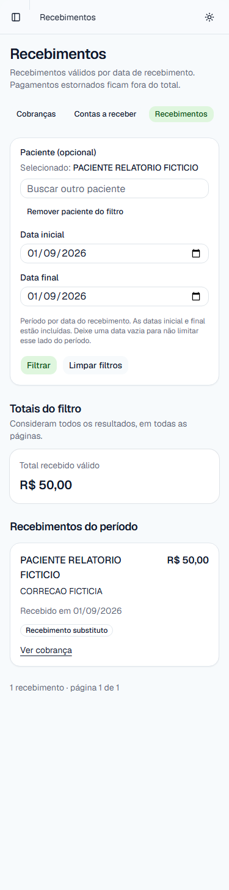

# FIN-03 — relatórios financeiros (#88)

Implementação e validação em **07/10/2026**, somente com dados fictícios.
Branch: `codex/fin-03-relatorios`; base: `056517079ce778fed98645b8c545edd941cc2eb7`.
Worktree isolado; alterações anteriores de cadastro, autenticação, agenda e auditoria
no checkout principal e no worktree de autenticação foram preservadas.

## Condições de início e estado do projeto

- FIN-01 integrada pela [PR #92](https://github.com/BrunoMNoronha/fisio-orto-sport/pull/92).
- FIN-02 integrada pela [PR #93](https://github.com/BrunoMNoronha/fisio-orto-sport/pull/93),
  na base acima. Árvore igual ao candidato validado `69d75ca`; [CI da main aprovada](https://github.com/BrunoMNoronha/fisio-orto-sport/actions/runs/37399715480).
- Gate do MVP fechado na #48/PR #91, pela [VAL-03](val-03-revalidacao-perfis.md).
  O roteiro de três perfis no build local do SHA publicado e os limites aceitos da
  VAL-02 continuam explícitos. O corpo histórico da #88 ainda mencionava o gate
  pendente; as entregas posteriores comprovam seu fechamento antes deste início.
- Roadmap e briefing foram corrigidos: FIN-02 integrada, FIN-03 candidata validada;
  publicação financeira e migrações em Preview/Production continuam separadas.

## Resultado e decisões técnicas

- `/financeiro/relatorios/contas-a-receber`: cobranças ativas com saldo positivo,
  cobrado, recebido válido, saldo e saldo vencido. Pagamentos são agregados por
  cobrança; quitadas/canceladas não contribuem. Vencimento anterior ao dia da clínica
  significa atraso; hoje continua em aberto. Consulta e apresentação usam o mesmo
  instante de referência em `America/Sao_Paulo`.
- `/financeiro/relatorios/recebimentos`: pagamentos sem estorno, pela data efetiva
  informada. Estorno exclui o original do período original; nenhum valor negativo é
  lançado no período do estorno. Substituto permanece vinculado ao histórico.
- Filtros GET opcionais: paciente por identificador, início e fim inclusivos,
  página. O período usa vencimento em contas e recebimento em recebimentos.
  Extremidades vazias são abertas; datas inexistentes, invertidas, repetidas e
  filtros desconhecidos são recusados antes da consulta. Paciente inexistente não
  amplia o filtro. CPF numérico é recusado e não conservado no formulário.
- Paginação estável de 20 itens, última página limitada; totais incluem todas as
  páginas e vazio soma zero. Valores e somas usam centavos inteiros/`bigint`, inclusive
  formatação acima de `Number.MAX_SAFE_INTEGER`.
- Paciente, totais e itens compartilham transação `RepeatableRead`. A escolha segue
  o [snapshot consistente do PostgreSQL 18](https://www.postgresql.org/docs/18/transaction-iso.html#XACT-REPEATABLE-READ)
  e a API do Prisma **7.10.0 instalado**, sem mudança de versão.
- SQL parametrizado e projeção explícita: do paciente apenas id, nome e situação;
  nenhum CPF, contato ou relação clínica. `financeiro:ler` verificado no servidor
  antes de leitura, inclusive nas queries chamadas diretamente. Permissões iguais
  dos três perfis conservadas; paciente inativo continua consultável.
- Migração `20261007010000_financeiro_relatorios` cria somente o índice global de
  `Payment(receivedOn DESC, createdAt DESC, id DESC)`. Índices anteriores de cobrança
  e de pagamento por cobrança atendem os outros filtros/agregados. Nenhuma entidade,
  fonte de saldo, escrita financeira ou efeito clínico novo.

## Verificações locais

| Verificação | Resultado |
|---|---|
| `pnpm install --frozen-lockfile --prefer-offline` | Passou; pnpm 11.25.0; lockfile preservado |
| `pnpm lint` e `pnpm typecheck` | Passaram |
| `pnpm exec jest --runInBand` | 92 suítes e 1.139 testes aprovados após os ajustes finais |
| `pnpm test:pipeline` | Nove testes aprovados; migration aditiva aceita |
| `pnpm test:integration` | 31 suítes / 188 testes aprovados, zero falhas e zero ignorados |
| Integração específica FIN-03 | 11 testes reais aprovados, incluindo quatro corridas entre agregado e itens |
| `pnpm build` | Passou; rotas financeiras incluídas no build de produção |
| `prisma migrate deploy` em PostgreSQL 18 descartável | 28 migrações aplicadas, incluindo índice FIN-03 |
| `prisma migrate diff --from-config-datasource --to-schema prisma/schema.prisma --exit-code` | Sem diferença |
| `git diff --check` | Passou |

Banco criado exclusivamente para esta execução: container `fisio-fin03-20261007`,
PostgreSQL 18, conexão de loopback na porta 55488, base `fisio_fin03_test`.
Nenhuma URL remota, segredo real ou banco preexistente foi usado nos testes.

`financeiro-relatorios.integration.ts` verifica R$100/R$30/R$70, estorno e correção,
canceladas/quitadas, datas inclusivas, fuso e pacientes inativos. O caso de volume
percorre 47 cobranças e 94 pagamentos, confere todos os IDs/páginas e compara cada
total com somas independentes em centavos, inclusive acima do limite Int32.

As quatro corridas usam um escritor em conexão independente que confirma pagamento
ou estorno entre o agregado e os itens de cada relatório. `RepeatableRead` conserva
o snapshot. Cada controle em `ReadCommitted` reproduz a incompatibilidade que a
implementação evita; nenhum hook de teste foi acrescentado ao produto.

## Navegador autenticado e tela móvel

Chromium headless local, build de produção (`pnpm start`) em loopback, sessão real
por e-mail/senha, três usuários e paciente fictícios. O navegador integrado da app
falhou ao inicializar; o runtime Chromium já instalado foi usado sem dependência
nova no projeto. Essa prova é técnica/local, sem domínio publicado ou aparelho real.

ADMIN, RECEPCAO e FISIOTERAPEUTA passaram pelo mesmo roteiro:

1. Login, contas a receber com 23 cobranças/duas páginas e saldo global R$309,00;
   cobrado R$410,00, recebido válido R$101,00, vencido R$149,00. Trocar de página
   conserva os totais. Cobrança de R$100/R$30 mostra saldo R$70 e “Vence hoje”.
2. Recebimentos de outubro com 23 pagamentos/duas páginas, total R$101,00;
   setembro filtrado em um único dia mostra apenas substituto de R$50,00. Link
   da cobrança permite conciliar original de R$70,00, estorno e substituto.
3. Período invertido exibe erro e nenhum total/lista ampliado. CPF recusado deixa
   o campo oculto de paciente vazio. Busca/seleção por setas e Enter, datas e envio
   do filtro por teclado funcionam, conservando o identificador selecionado.
4. Viewport de **375 px**: largura da página igual à largura visível, sem overflow
   horizontal em contas, recebimentos e paginação. Nenhum erro JavaScript de página.

Anônimo redirecionado ao login; usuário inativo recusado no login. Recepção tentou
anamnese do paciente fictício e foi redirecionada a `/acesso-negado`. Chamadas diretas
das queries também negam anônimo/inativo antes da persistência nos testes unitários,
com mock de sessão e matriz real de permissões, distintos da sessão do navegador.

## Entrega e limites

Candidato para revisão via PR na pipeline vigente. Merge e encerramento da #88
seguem a entrega à `main`; nenhum merge ou deploy foi executado nesta validação.
Aplicar o índice pelo release `main → production → Preview → Production manual`,
junto das migrações financeiras anteriores antes de usar o financeiro publicado.
Rollback da aplicação conserva tabelas/histórico e o índice pode permanecer.

Exportação, impressão, contabilidade, despesas, repasses, cobrança real, integração
externa e efeitos sobre agenda/prontuário continuam fora do escopo.
